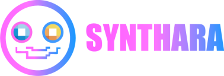
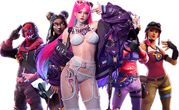

  

  3D Virtual Human Ecosystem Built on AI-AGENT

# Synthara Labs

**Synthara** based on AI-MemeVerse 3.0, our aim is to enable everyone to create and own their meme virtual humans by combining AI-Agent with 3D virtual humans, promoting meme culture to evolve into a new form of digital identity and economic system in the wave of Web3.

## Virtual Human

By integrating AI, 3D virtual humans, and Web3 features, we create a virtual social and creative platform centered around meme culture. Our core philosophy is that 'everyone can create and interact with their own virtual meme human, making memes a unique digital asset and identity symbol.'

    

## Uses of Virtual Humans

### Virtual Human Applications
Each meme character, as an NFT, can generate motion emojis, short videos, and bring tipping revenue. Users can create sub-brands based on virtual meme humans (such as exclusive stickers and merchandise) and earn revenue sharing.

### NFT Trading
Each meme virtual human is a tradable NFT with upgradeability (unlocking new actions, story narratives, and decorations through tasks).

## Verse 3.0 Product Form
By integrating AI, 3D virtual humans, and Web3 features, we create a virtual social and creative platform centered around meme culture. Our core philosophy is that 'everyone can create and interact with their own virtual meme human, making memes a unique digital asset and identity symbol.'

### AI-Driven Creation
- Users generate 3D virtual meme characters with unique styles and expressions through brief text prompts (like ChatGPT instructions).
- AI-Agent supports instant optimization: generating diverse clothing, unique lines, or actions to adapt to meme trends.

### 3D Virtual Human Interaction
- Each meme virtual human is a tradable NFT with upgradeability (unlocking new actions, story narratives, and decorations through tasks).
- Users can create short videos, animated emojis with virtual humans, and even achieve 'user as meme' through motion capture.

### Web3 Community Gameplay
- Users can upload meme ideas, and the community selects the most popular memes through voting or token support.
- Regularly hold Meme PK contests, where virtual humans compete in themed dynamic videos, with users voting or betting to determine the winner, such as 3D virtual Dancers battles.

## Unique Creative Points

### Meme as Identity
Users' virtual meme humans can become their decentralized identities (DiD) and be used both within and outside the platform. Unlock new identity privileges through social interaction, game participation, or community activities.

### Monetization of MEME Ecosystem
Each meme character, as an NFT, can generate motion emojis, short videos, and bring tipping revenue. Users can create sub-brands based on virtual meme humans (such as exclusive stickers and merchandise) and earn revenue sharing.

### Decentralized Content Governance
Use Web3 voting mechanisms (DAO) to screen meme content, ensuring the community is healthy and interesting. Provide platform support for promising meme creations and incentivize more user participation.

## Link

- [SyntharaLabs website](https://syntharalabs.io)